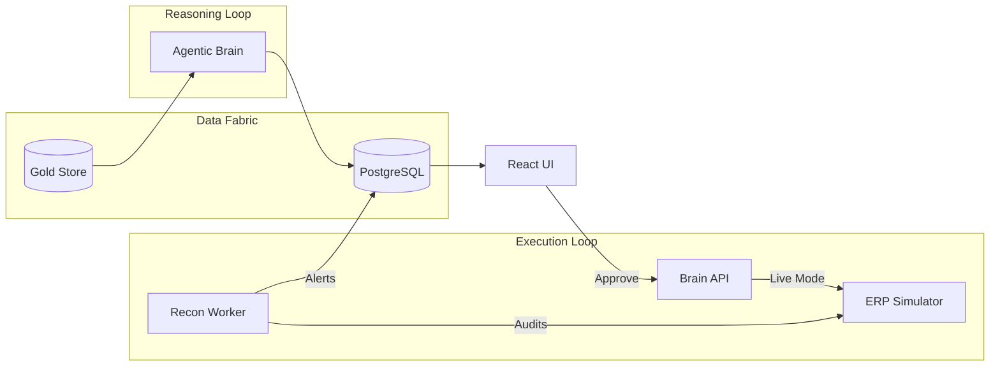

# NEXUS-SCM Sovereign Supply Chain: Master Project Log

This document tracks the architecture and implementation of the NEXUS-SCM project—a self-healing, agentic supply chain platform.

## 🏛️ Phase 1 & 2: The Neural Data Fabric (The Memory)
*   **Objective**: Build a high-integrity analytic store (Gold Feature Store).
*   **Outcome**: Functional PostgreSQL schema `gold_scm_features`.
*   **Key Logic**:
    *   H3 geospatial indexing for Indian EV territories.
    *   30-day Temporal Shift for Data Leakage Prevention.
    *   Reconciled Vahan Retail data with Port Congestion indices.

## 🔮 Phase 3: The Agentic Reasoning Brain (The Intellect)
*   **Objective**: Move from "Diagnostics" to "Prescriptive Autonomy."
*   **Outcome**: `agentic_brain.py` reasoning engine.
*   **Key Components**:
    *   **Probabilistic Sensing**: Quantile Regression for demand uncertainty.
    *   **Digital Twin**: 10,000-scenario Monte Carlo (Fat-Tail) risk simulation.
    *   **Stochastic MEIO**: LP solvers for multi-echelon stock balancing.
    *   **Agentic Hub**: A React-based Mission Control with SHAP-explainable decision cards.

## ⚙️ Phase 4: The Autonomous Execution Loop (The Hands)
*   **Objective**: Bridge the gap between AI reasoning and Corporate Execution.
*   **Outcome**: Bidirectional ERP integration.
*   **Key Components**:
    *   **ERP Simulator**: A mock SAP S/4H gateway with a sqlite transaction ledger.
    *   **Transactional API**: Brain-API with Shadow/Live execution toggles and transactional retry logic.
    *   **Integrity Audit**: Background Reconciliation Worker to detect "Ghost Orders."
    *   **Bullwhip Prevention**: Dynamic "On-Order" visibility logic in the Brain sensing loop.

## 📐 Current System Architecture (Active)

---
**Status**: ACTIVE_SOVEREIGN_MODE
**Version**: v4.2.0-Alpha
