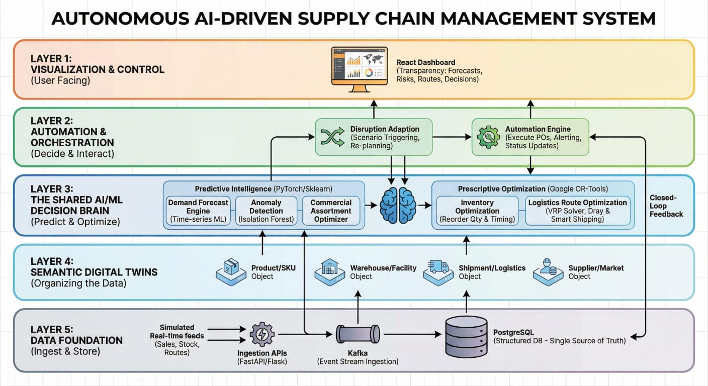

# NEXUS-SCM: Autonomous AI-Driven Supply Chain Management

**NEXUS-SCM** is a high-fidelity intelligence platform built to eliminate structural blind spots in the Indian EV market. By transitioning from reactive sales-based forecasting to **Causal Agentic Intelligence**, the system anticipates demand shifts 60 days in advance.

---

## System Architecture
 
*The system is organized into 5 functional layers, enabling a closed-loop "Observe-Orient-Decide-Act" (OODA) cycle.*

---

## Layered Technical Breakdown

### Layer 1 & 2: Visualization & Orchestration
* **React Command Center:** A live "Control Tower" providing transparency into probabilistic forecasts, risk vectors, and autonomous decisions.
* **Automation Engine:** Handles scenario triggering and re-planning, executing Purchase Orders (POs) through structured API payloads.

### Layer 3: The Shared AI/ML Decision Brain
This is the "Neural Core" of the project, splitting tasks into:
* **Predictive Intelligence:** A hybrid ensemble of **Bass Diffusion** (for adoption S-curves) and **LightGBM Quantile Regression** (for residual volatility).
* **Prescriptive Optimization:** Uses **PuLP** and **Google OR-Tools** to solve Multi-Echelon Inventory Optimization (MEIO) problems, ensuring a **98% service level (Z=2.054)**.

### Layer 4 & 5: Semantic Digital Twins & Data Foundation
* **Digital Twinning:** Every SKU, Warehouse, and Supplier is modeled as a semantic object, allowing the AI to simulate "What-If" scenarios.
* **Unified Data Fabric:** Real-time ingestion via **FastAPI** and **Kafka** event streams, persisted in a high-concurrency **PostgreSQL** environment.

---

## Core Mathematical Innovation

### 1. The Causal Lead Signal
NEXUS-SCM identifies that Indian EV registrations are downstream of physical events. We engineer features on:
* **Asian Battery Lead Signal:** 60-day lag correlation with domestic sales.
* **Maker Volume Delta:** Real-time production signals from Tata, Ola, and Mahindra.

### 2. Stochastic Safety Stock
Instead of static reorder points, we compute optimal stock levels dynamically:
$$\text{Optimal Stock} = \text{P90}_{\text{demand}} + (Z \times \sigma_{\text{lead\_time}})$$
*This prevents stockouts during "Battery Starvation" events identified by the Anomaly Detector.*

---

## Deployment & Usage
1. **Clone:** `git clone https://github.com/saharshasamudrala05/EV_Autonomous_SCM.git`
2. **Setup:** `pip install -r backend/requirements.txt`
3. **Initialize:** `python backend/data_pipeline/seed_database.py`
4. **Launch:** `uvicorn backend.main:app --reload`